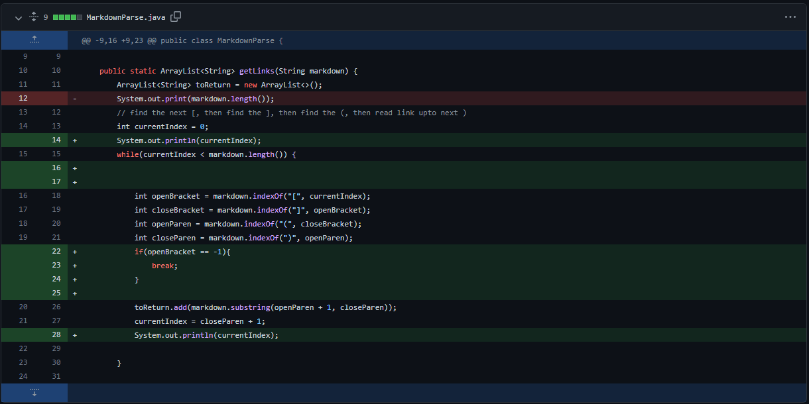
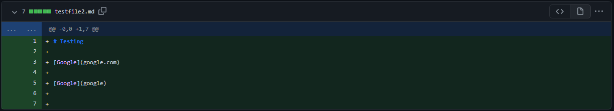
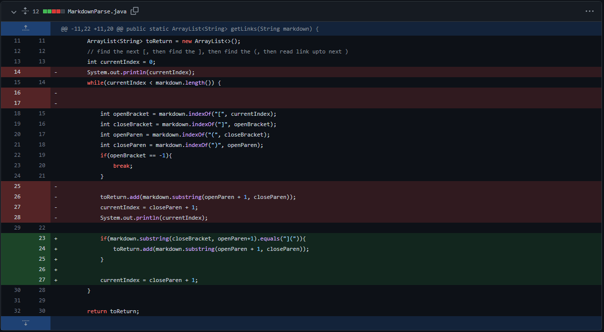
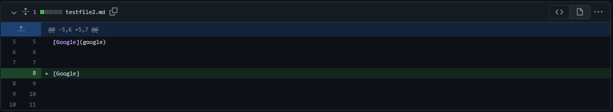
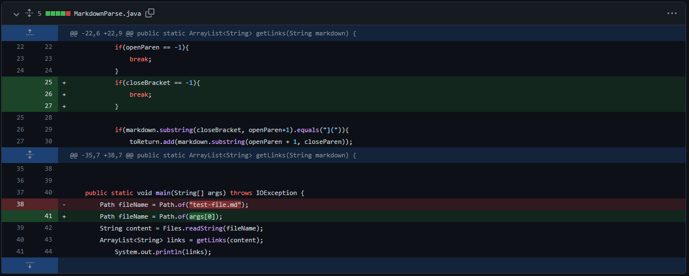
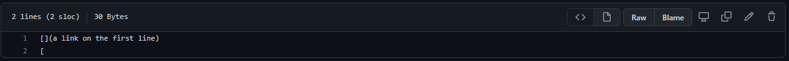

# **Lab Report 2 - Week 4**

## **Code Change 1**
The image provided below is the first code change that I made the MarkdownParse.java file.

One of the errors that I ran into while running some test cases on the provided code that we were provided for the lab. I noticed that the code we were provided for the MarkdownParse did not run properly against the file that I created for the lab. 

Below are the contents of [testfile2.md](https://github.com/TuannDang/markdown-parser/blame/556f9dcf3bb0800a7386c049f6570512291b8aea/testfile2.md) 

The bug that caused this issue would be the while loop running infinitely times until the index was greater than the length of the contents of the file. To produce this bug with the original program, there had to be empty spaces after a link of markdown. 

So, the symptom I had here was that if I was to run the MarkdownParse file on [testfile2.md](https://github.com/TuannDang/markdown-parser/blame/556f9dcf3bb0800a7386c049f6570512291b8aea/testfile2.md), I would run into an infinite loop which would eventually cause my computer to run out of memory which would lead the program to crash. This infinite loop was caused by the while loop continuously returning -1 because there was no open bracket found after the two links that were already in the [testfile2.md](https://github.com/TuannDang/markdown-parser/blame/556f9dcf3bb0800a7386c049f6570512291b8aea/testfile2.md) file.

With the failure inducing input, I was able to make the code changes provided above in order to produce the correct results for the program. 

---

## **Code Change 2**

The following is the second revision of the MarkdownParse file. 

Below are the contents of the second revision of [testfile2.md](https://github.com/TuannDang/markdown-parser/blob/c6aab6fec79bfd3402776433d09df8d2876facb2/testfile2.md). 

After running this failure inducing input on the MarkdownParse file, I realized that the loop would run an infinite amount of time after it found the closed bracket. So this, failure inducing input caused the bug which would be the line where the code is trying to find the index of the open parenthesis given the index of the closed bracket. This bug led to the symptom of an infinite loop. 

This bug I resolved by implementing an if statement that would check if an open parenthesis immediately follows the closed bracket. 

---

## **Code Change 3**

Below are the contents of [test-file8.md](https://github.com/TuannDang/markdown-parser/blob/main/test-file8.md)

Test file 8 was the failure inducing input that caused a bounds error. After looking at the contents of [test-file8.md](https://github.com/TuannDang/markdown-parser/blob/main/test-file8.md). I realized that there is no closed bracket after the last instance of an open bracket. Which would cause the program to return a -1 because the closed bracket could not be found. This then caused an out of bounds error when the program went on to use the substring method using the provided -1. 

I was able to resolve this bug by creating an if statement to check if the index of the closed bracket was equal to -1, which would be returned if it could not be found in the contents of the file. 