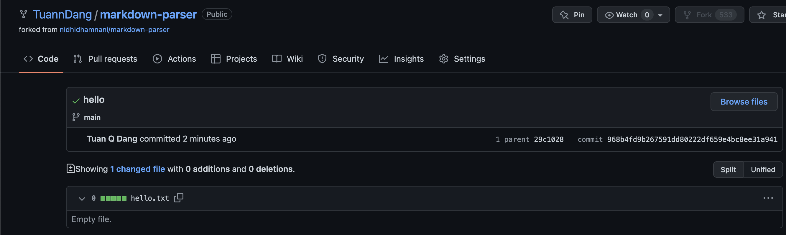

# Lab Report 3 - Week 6

## Streamlining SSH Configuration

 So for the SSH configuration file I simply used the terminal and the command line to edit my configuration. Provided below is my .ssh/config file 

For the log in process I simply logged into the ieng6 account by typing `ssh ieng6` into the command line

In order to copy a file to the remote server, I needed to run the following command line to have it securely copy a file from my machine (locally) to the remote machine. 

`scp /folderDirectory ieng6:~/`

The command line simply copied my file into the home directory of my ieng6 account. Below is the result of myself running the command line above. 

___

## Setup Github Acess from ieng6

Provided in the screenshot below, I've added the public key on my laptop and the public key from the ieng6 server and the SSH keys to github.
Here are where my public keys are stored in for [Github](github.com).

The SSH keys stored on the ieng6 account are stored in a folder called .ssh. I have went ahead and used the command line `ls` to list the files inside the directory. Using this command line I can display the files that are inside this directory *.ssh*

Now that I have provided my personal laptop and the ieng6 account github access. I will try to push and create some contents using the ieng6 server. Before I went ahead and pushed the changes I made I used the command lines `touch hello.txt` to create a new text file named hello. In order to save my changes I needed to also run the line git add hello.txt. Then I used `git commit -m "message"` to commit my changes. 

After running this I have ran the git push command which pushes the changes to the origin.

Below is the screenshot of the successful push and commit to the repository. Provideded is also the link to the [successful commit](https://github.com/TuannDang/markdown-parser/commit/968b4fd9b267591dd80222df659e4bc8ee31a941).

___
## Copy whole directories with scp -r

Using the command line:

`scp -r . ieng6:~/markdown-parse` 

I was able to clone my working directory into the directory of markdown-parse on the ieng6 server.

In order to run the JUnit tests on the ieng6 machine, I have to run the following command lines in order to compile and run the JUnit tests that I have created.

`javac -cp .:lib/junit-4.13.2.jar:lib/hamcrest-core-1.3.jar MarkdownParseTest.java`

`java -cp .:lib/junit-4.13.2.jar:lib/hamcrest-core-1.3.jar org.junit.runner.JUnitCore MarkdownParseTest`

The image below shows the result of running the two command lines on the ieng6 server.

`scp -r *.java *.md lib/ ieng6:markdown-parse; ssh ieng6`

Pairing what I did previously with streamlining the SSH connection process, I ran the command line above which copies all of the java files, all of the markdown files and the library directory to the ieng6 server and into the markdown-parse directory. After this it is expected to run the command line ssh ieng6 which connects me directly to the ieng6 server right after the files are copied.

Provided below is a screenshot of the process running smoothly!

Now that I have been able to copy over my files correctly onto the ieng6 machine. Let's now try to run multiple lines that allow me to copy my markdown-parse folder and also be able to compile the test files!

The command that I have ran below is:

`scp -r . cs15lsp22aqb@ieng6.ucsd.edu:~/markdown-parse; ssh ieng6 "cd markdown-parse; /software/CSE/oracle-java-17/jdk-17.0.1/bin/javac -cp .:lib/junit-4.13.2.jar:lib/hamcrest-core-1.3.jar MarkdownParseTest.java; /software/CSE/oracle-java-17/jdk-17.0.1/bin/java -cp .:lib/junit-4.13.2.jar:lib/hamcrest-core-1.3.jar org.junit.runner.JUnitCore MarkdownParseTest"`

Remember to replace the `cs15lsp22aqb` with the 3 or 2 letters of your course specific username!

Below is the result of successfully running this command line. 

