# **Lab Report 4 - Week 8**

## **Snippet 1**

This is the first code snippet that we are provided:

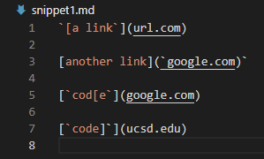

I created my test cases based on what was displayed when I copied and pasted the markdown snippets we were provided onto the [Common Mark demo site](https://spec.commonmark.org/dingus/).

The image below shows how the markdown snippet was formatted on the [demo site](https://spec.commonmark.org/dingus/).

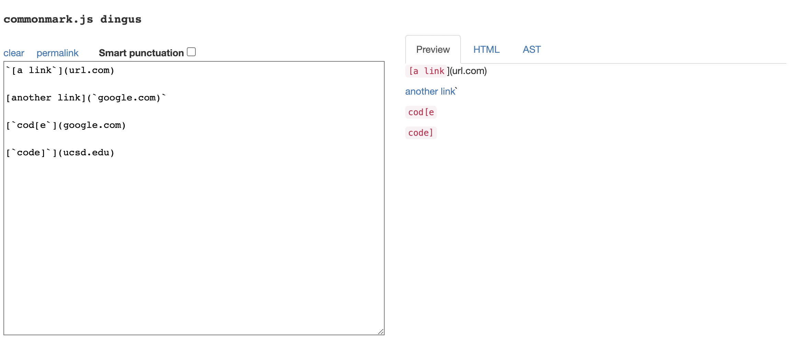

With what was displayed on the [Common Mark demo site](https://spec.commonmark.org/dingus/) the image below showed how I interpreted what should be returned as a result of the preview on the demo site.

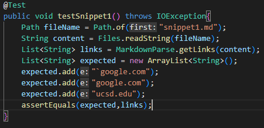

So the first line on the snippet should not return a link. The second line of the snippet will add a link of 
`` `google.com `` 

The next two lines that proceed this will be expected to add 
``google.com`` and ``ucsd.edu`` to the String ArrayList because those links are hyperlinked inside the code brackets. 

After running the JUnitTest on my implementation, my implementation failed. The image below shows the JUnitAssertion that was produced as a result of my implementation failing. 

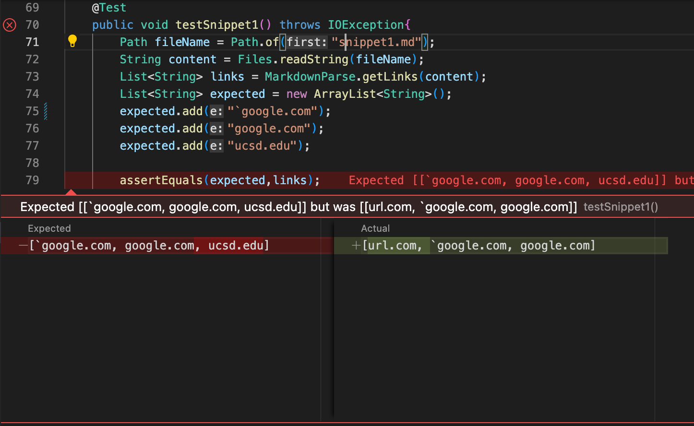

I also ran the same implementation that I created based on the preview on the implementation that I reviewed during the lab on week 7. 

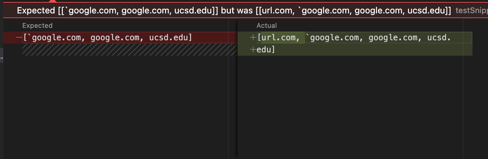

Unfortunately, both implementations failed this test case. However, the implementation that I reviewed during the week 7 lab was much closer to the result that I was expecting. 

___

## **Snippet 2**

This is the second markdown snippet:

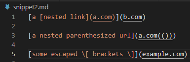

The image below shows how the markdown snippet was formatted on the [demo site](https://spec.commonmark.org/dingus/).

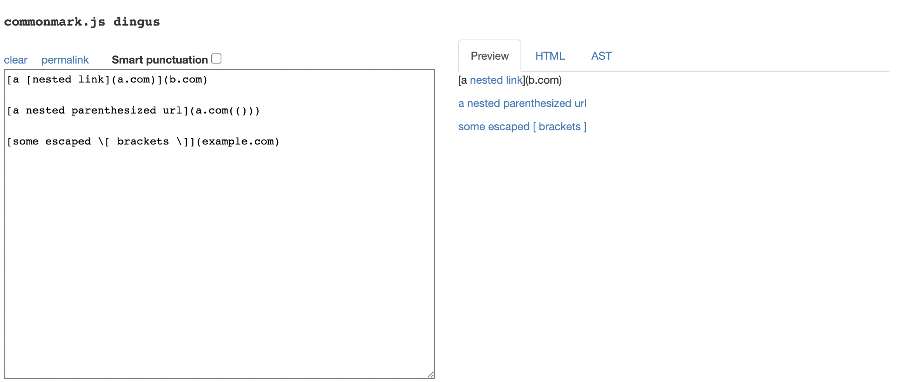

With what was displayed on the [Common Mark demo site](https://spec.commonmark.org/dingus/) the image below showed how I interpreted what should be returned as a result of the preview on the demo site.

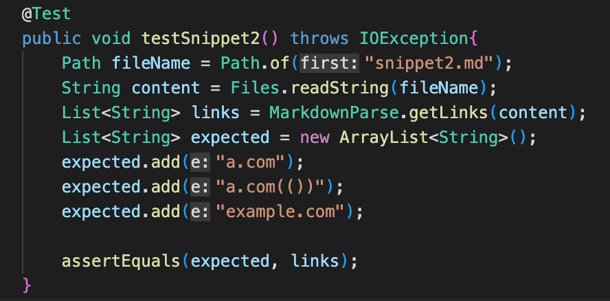

From the first line of the markdown snippet, we are expecting ``a.com`` to be added as a link to the String ArrayList. 

The following line has an embedded link to ``a.com(())`` and we are expecting this to be added as well to the String ArrayList based on the preview provided by Common Mark. 

The line following is also expected to append ``example.com`` to the String ArrayList. 

With the expected results created in my method of the JUnitTest, after running the JUnitTest on my implementation, my implementation failed. The image below shows the JUnitAssertion that was produced as a result of my implementation failing. 

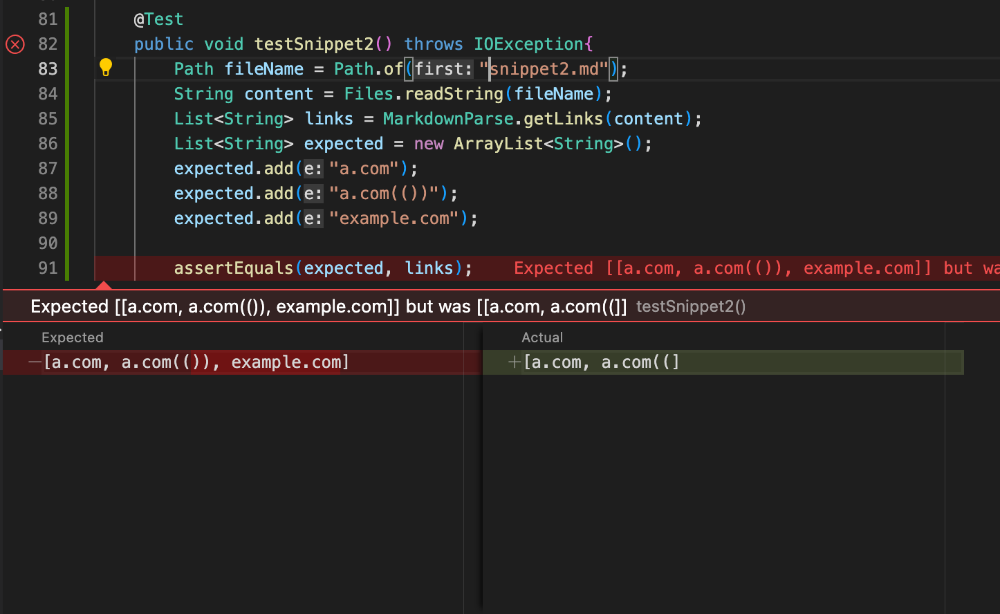

Testing the same JUnitTest on the implementation reviewed from week 7, below is the result running the JUnitTest:

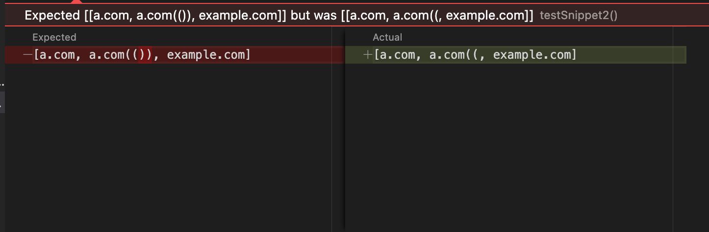

Both impementations failed once again using the expected test case, but the implementation from week 7 was much closer to the result we are expecting. 

___ 

## **Snippet 3**

This is the third markdown snippet:

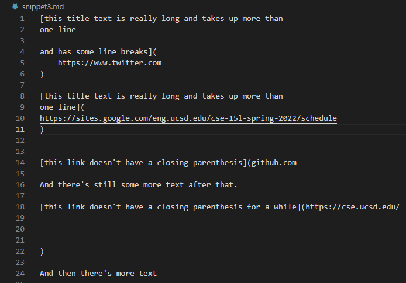

The image below shows how the markdown snippet was formatted on the [demo site](https://spec.commonmark.org/dingus/).

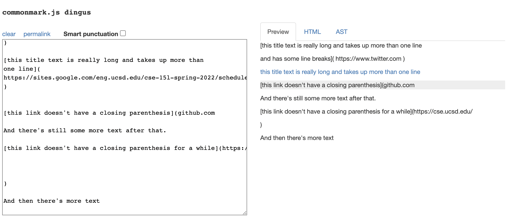

With what was displayed on the [Common Mark demo site](https://spec.commonmark.org/dingus/) the image below showed how I interpreted what should be returned as a result of the preview on the demo site.

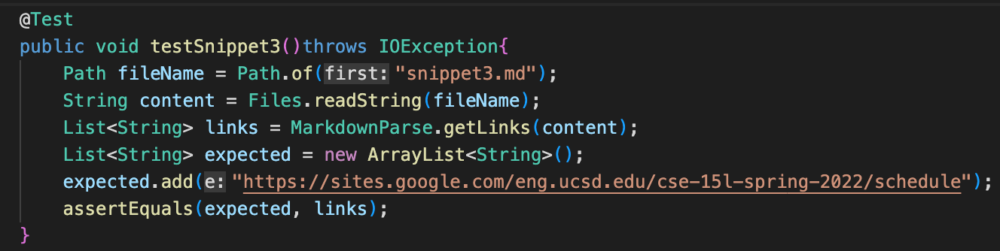

From what the preview displayed on [Common Mark demo site](https://spec.commonmark.org/dingus/), I am expecting only ``https://sites.google.com/eng.ucsd.edu/cse-15l-spring-2022/schedule`` to be added to the String ArrayList. 

From testing the expected results for snippet 3, the image snippet below shows the results of testing on my implementation:

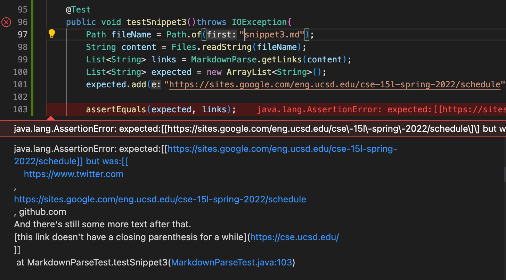

Testing the same JUnitTest on the implementation reviewed from week 7, below is the result running the JUnitTest:

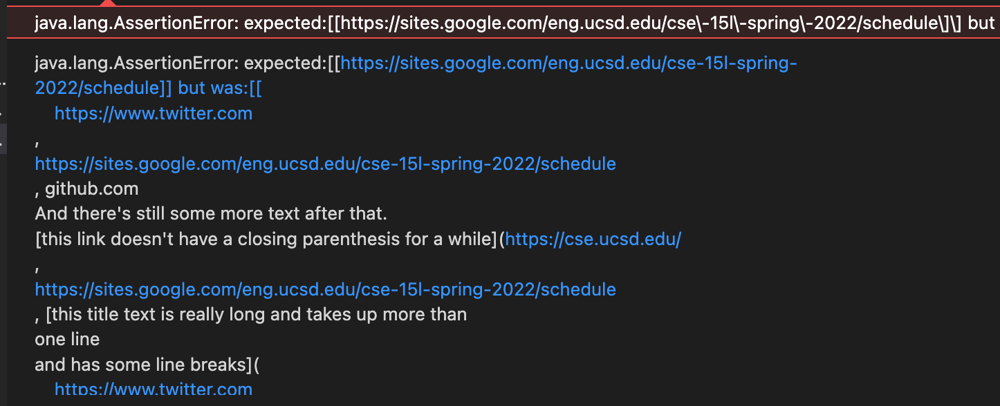

As we can see from the results provided above, both implementations failed to produce the expected results. 

___

## Response to the following questions:

**Do you think there is a small (<10 lines) code change that will make your program work for snippet 1 and all related cases that use inline code with backticks? If yes, describe the code change. If not, describe why it would be a more involved change.**
    
- I think there is a small change that will make my program work for snippet 1. The issue with the test case here were the inline code with backticks. I think I could make some slight modifications to make my program simply ignore the backticks if it finds anywhere within the closed brackets, because those will be formatted as code, rather than a link.

**Do you think there is a small (<10 lines) code change that will make your program work for snippet 2 and all related cases that nest parentheses, brackets, and escaped brackets? If yes, describe the code change. If not, describe why it would be a more involved change.**

- I don't think there is a small change that I can cmake within less than 10 lines of code change that will make my program work for snippet 2. The issue with this markdown snippet is that, if there were nested parantheses within the link, then it would stop at the first instance of a closed paranthesis, which will lead to producing incorrect results. Approaching this problem will be time consuming and will take at least 10+ lines of code change to approach this issue.

**Do you think there is a small (<10 lines) code change that will make your program work for snippet 3 and all related cases that have newlines in brackets and parentheses? If yes, describe the code change. If not, describe why it would be a more involved change.**

- No, I do not think there is a small code change that will make this program work for snippet 3. This will take more than ten lines in order to make the program work and for all newlines created in brackets and parentheses. I think it will require a lot more work to differentiate what produces a link and what does not produce a link based on newlines created within brackets and parentheses.

